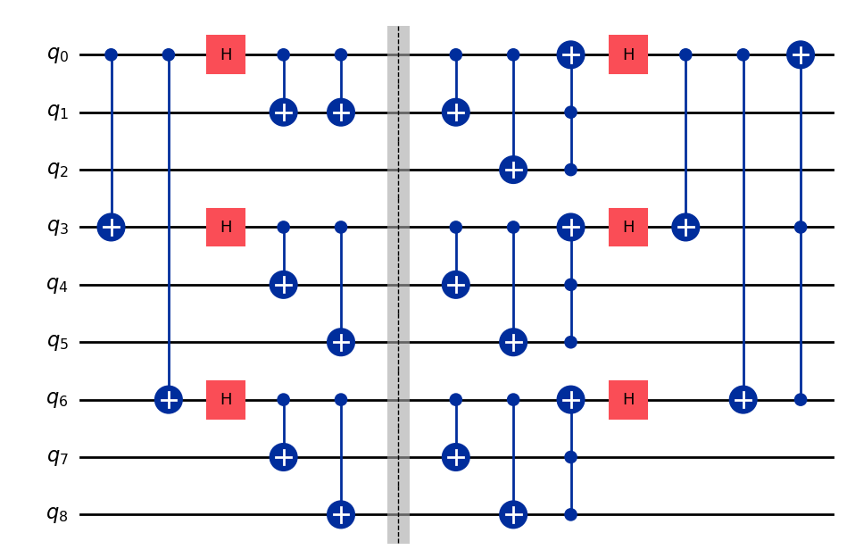

# Quantum Adder

<p align="center">
  
</p>

> The image above is the circuit for Shor code

The final project for the Quantum Computing class (Physics 5001, Fall 2024) I took at Missouri S&T was to create a adder circuit and run it on a real quantum computing using IBM Quantum. As quantum computers have a lot of errors, part of the assignment was to add Shor code error correction to the adder circuit.

There are multiple jupyter notebooks in the `notesbooks` folder. Each file has a different circuit that was tested.

- `adder.ipynb`: A basic adder circuit built using sum, carry, and inverse carry gates, with no error correction.
- `corrected_end.ipynb`: An adder circuit where Shor error checking is only done once at the end of the whole process.
- `corrected_all.ipynb`: An adder circuit where the Shor error checking is done after every operation.
- `transversal.ipynb`: An adder circuit with transversal adder operations and Shor error checking after every operation.

`testing.ipynb` has some circuits I built to test how different transversal gates worked in Shor code and `miscellaneous.ipynb` contains displays of the sum, carry, and inverse carry operations used. The folder also has a subfolder `helpers` with three files: `common.py`, `gates.py`, and `constants.py`. These files have functions and classes used by every notebook.

## Running the Notebooks

All the notebooks were originally run with Python 3.12.7 using the package versions listed in `requirements.txt`.

1. Install the required Python packages using a package manager.
2. Create a `.env` file in the root directory.
3. Add the key `IBM` to the environment file. Set it equal to your API token from [IBM Quantum](https://www.ibm.com/quantum).
4. Run the notebook using jupyer.

```bash
jupyter notebook file.ipynb
```
